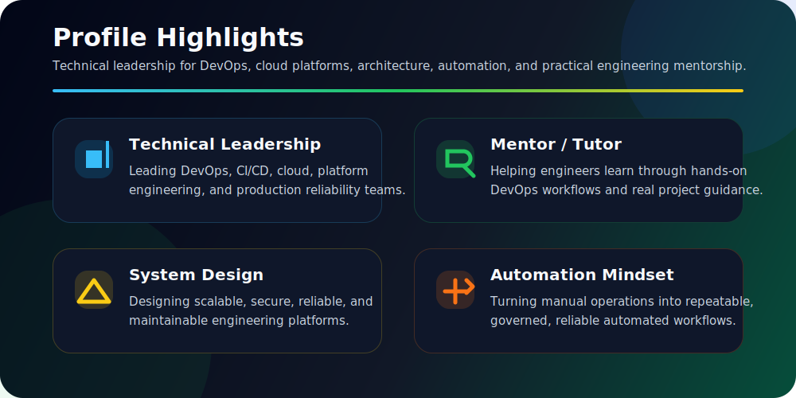
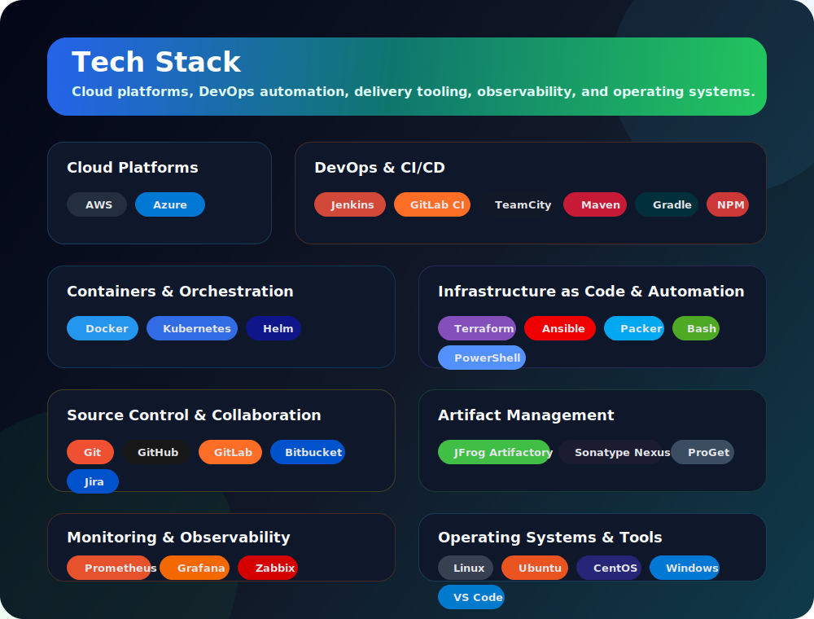
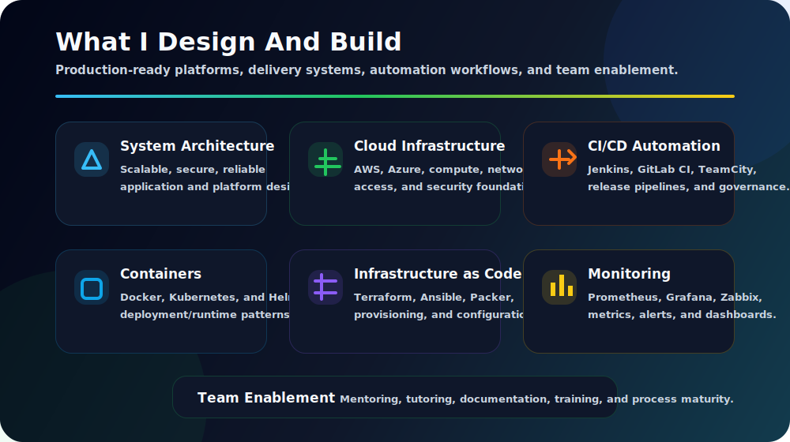
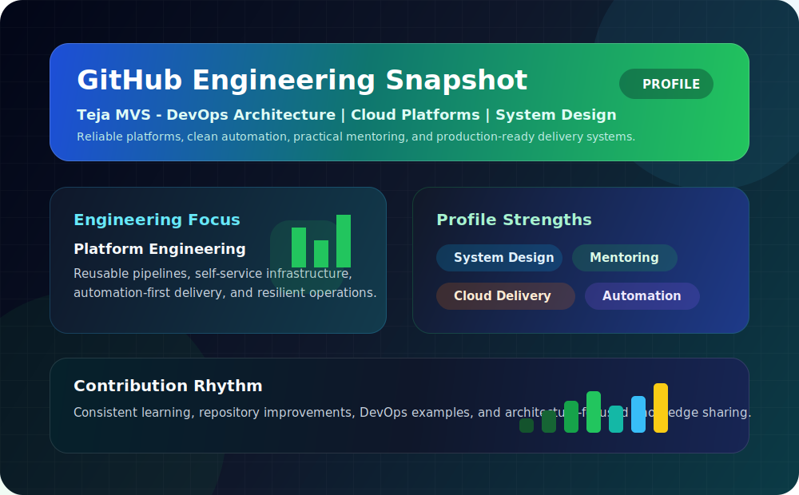

<h2>Technical Team Lead | 10+ Years Experience</h2>

<h3>DevOps Architecture | Cloud Platforms | System Design | Mentor / Tutor</h3>

  I love designing systems, building scalable architecture, mentoring engineers, and creating reliable DevOps platforms.

  
  
  

  
  
  
  

---

## Profile Highlights

  

---

## About Me

I am a DevOps and Cloud professional from India with 10+ years of experience in technical leadership, platform engineering, cloud infrastructure, CI/CD automation, and mentoring.

- Technical Team Lead with strong ownership of delivery platforms and engineering enablement
- Mentor and tutor for DevOps, Cloud, Kubernetes, CI/CD, automation, and infrastructure practices
- Passionate about system design, architecture design, scalable platforms, and clean operational models
- Focused on secure, repeatable, production-ready infrastructure and deployment workflows
- Open to discussions on DevOps, Cloud, Kubernetes, CI/CD, Infrastructure as Code, monitoring, and architecture

---

## Leadership Focus

| Area | What I Care About |
| --- | --- |
| Platform Engineering | Developer-friendly tooling, reusable pipelines, and self-service infrastructure |
| DevOps Transformation | Automation strategy, release governance, process maturity, and team enablement |
| System Architecture | Scalable designs, clean boundaries, reliability, security, and maintainability |
| Cloud & Infrastructure | AWS, Azure, provisioning, configuration, networking, and operational excellence |
| Observability | Monitoring, alerting, dashboards, service health, and reliability practices |
| Training & Mentorship | Practical learning for students, freshers, and engineering teams |

---

## Tech Stack

  

---

## What I Design And Build

  

---

## GitHub Snapshot

  

---

## Connect

I enjoy mentoring engineers, tutoring DevOps learners, and helping teams design better systems, stronger platforms, and smoother delivery pipelines.

- Email: **venkatasuryamaddula@gmail.com**
- LinkedIn: [Teja MVS](https://www.linkedin.com/in/tejamvs/)
- YouTube: [DevOps Learning](https://bit.ly/3ecN8l5)

### Building better systems, better platforms, and better engineering teams.

