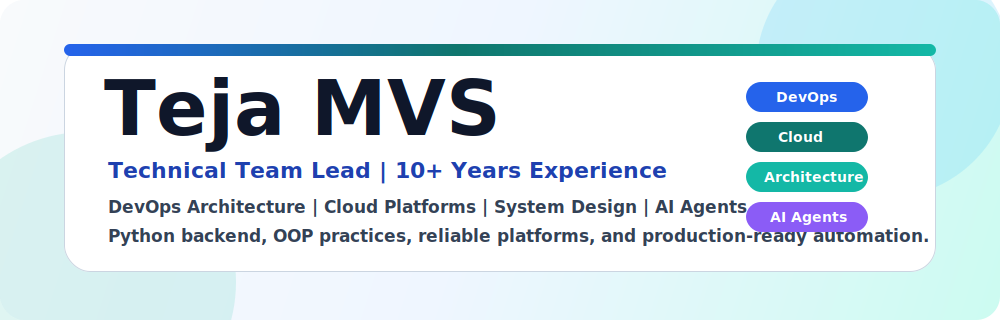

 

 
 

---

## Professional Summary

I am **Teja MVS**, a DevOps and Cloud professional from India with **10+ years of experience** in technical leadership, platform engineering, CI/CD automation, cloud infrastructure, system design, mentoring, and production reliability.

I enjoy designing scalable systems, building reliable DevOps platforms, simplifying engineering workflows, mentoring teams, and exploring AI agent workflows with Python backend engineering.

---

## Core Strengths

| Area | Professional Focus |
| --- | --- |
| Technical Leadership | Leading DevOps, cloud, CI/CD, infrastructure automation, platform engineering, and reliability initiatives |
| System Design | Designing scalable, secure, reliable, and maintainable application and platform architectures |
| DevOps Transformation | Improving release processes, automation maturity, delivery governance, and team enablement |
| Cloud & Infrastructure | Working with AWS, Azure, provisioning, access, networking, security, and operational foundations |
| AI & Backend Engineering | Exploring AI agents, Python backend services, OOP design, APIs, and automation helpers |
| Mentoring / Tutoring | Helping students, freshers, and engineers learn DevOps through practical workflows and real examples |

---

## Tech Stack

| Category | Tools & Platforms |
| --- | --- |
| Cloud Platforms |   |
| AI & Backend |     |
| DevOps & CI/CD |       |
| Containers & Orchestration |    |
| Infrastructure as Code & Automation |      |
| Source Control & Collaboration |      |
| Artifact Management |    |
| Monitoring & Observability |    |
| Operating Systems & Tools |      |

---

## What I Design And Build

| Capability | What I Deliver |
| --- | --- |
| System Architecture | Scalable, secure, reliable application and platform designs |
| Cloud Infrastructure | AWS and Azure foundations covering compute, networking, access, and security |
| CI/CD Automation | Jenkins, GitLab CI, TeamCity, release pipelines, quality gates, and governance |
| Containers | Docker, Kubernetes, Helm-based deployments, and runtime design patterns |
| Infrastructure as Code | Terraform, Ansible, Packer, provisioning, configuration, and repeatable environments |
| AI Agent Workflows | AI-assisted automation, agent workflow concepts, and productivity-oriented engineering helpers |
| Python Backend & OOP | Backend services, API design, reusable classes, object-oriented design, and automation utilities |
| Monitoring & Reliability | Prometheus, Grafana, Zabbix, metrics, alerts, dashboards, and service health practices |
| Team Enablement | Mentoring, tutoring, documentation, training, and engineering process maturity |

---

## Professional Focus

| Focus Area | Value I Bring |
| --- | --- |
| Platform Engineering | Developer-friendly tooling, reusable pipelines, and self-service infrastructure |
| Automation First | Manual release, infrastructure, and operations processes converted into reliable workflows |
| Production Readiness | Secure, repeatable, maintainable, and operations-friendly engineering systems |
| Knowledge Sharing | Practical DevOps examples, hands-on guidance, and mentoring for students and engineers |

---

## GitHub Profile

| Item | Details |
| --- | --- |
| Profile Name | **Teja MVS** |
| GitHub Username | [`devops-surya`](https://github.com/devops-surya) |
| Repository Focus | DevOps learning, platform engineering, CI/CD, automation, cloud infrastructure, and backend engineering |
| Engineering Theme | Reliable systems, clean delivery pipelines, production-ready automation, and practical learning |

---

## Connect

I enjoy mentoring engineers, tutoring DevOps learners, and helping teams design better systems, stronger platforms, and smoother delivery pipelines.

- **Email:** venkatasuryamaddula@gmail.com
- **LinkedIn:** [Teja MVS](https://www.linkedin.com/in/tejamvs/)
- **YouTube:** [DevOps Learning](https://bit.ly/3ecN8l5)

### Building better systems, better platforms, and better engineering teams.

